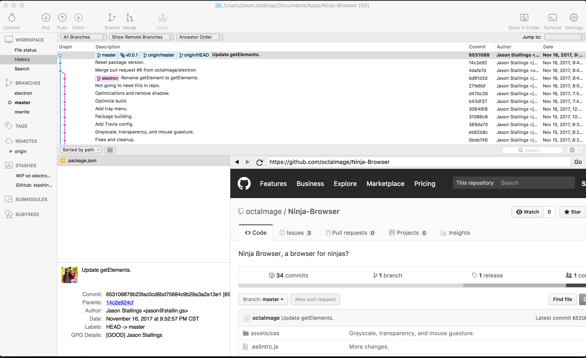

	

# Description

Ninja Browser is a browser that is instantly at your finger tips. It attempts to embed itself in the currently active window.

To activate the browser, move the mouse to each side of the screen.

For example, move the mouse to the left side, then the right, then the left side again, and the browser will embed itself in the current window.
