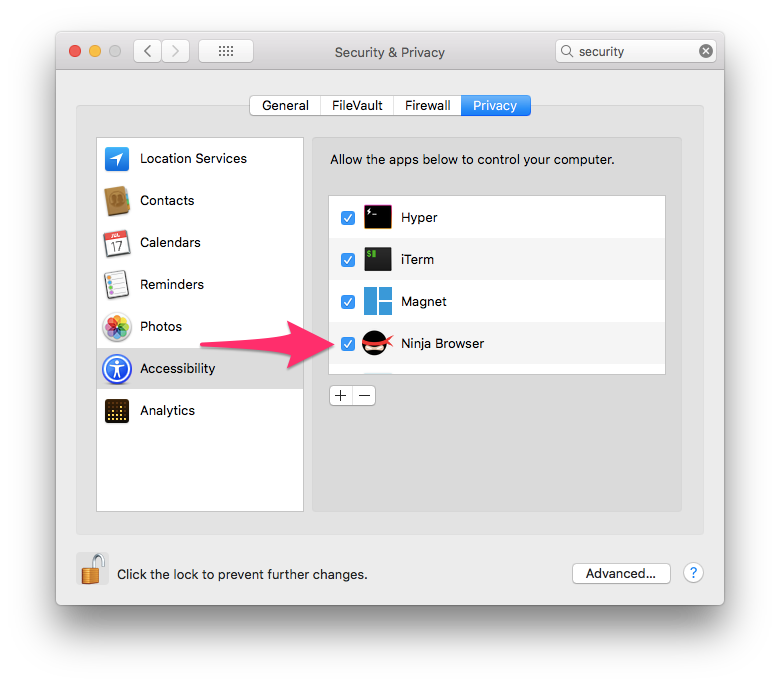

# Ninja Browser

	

## Description

Ninja Browser is a browser that is instantly at your finger tips. It attempts to embed itself in the currently active window.

To activate the browser, move the mouse to each side of the screen.

For example, move the mouse to the left side, then the right, then the left side again, and the browser will embed itself in the current window.

## Demo

## Usage

After opening Ninja Browser for the first time you need to grant it access to the Mac accessibility API. This is needed to allow Ninja Browser to find the optimal hiding place. You'll be prompted to open System Preferences:

Then make sure Ninja Browser is checked in the accessibility list:

Then you're ready to go! Open Ninja Browser using the hotkey <kbd>Command</kbd>+<kbd>Option</kbd>+<kbd>b</kbd>, or by moving the mouse to each side of the screen.

## Story

TLDR: This is based on an old browser called Ghostzilla.

A long time ago there was a browser for Windows called Ghostzilla. It would embed itself in the active window and attempt to disguise the website to better match the application. I loved Ghostzilla and used it a bunch in school. Well it used the Gecko renderer engine and eventually the original developers stopped updating Ghostzilla in 2002. This meant that due to the old rendering engine modern websites wouldn't render properly. So in 2007 I decided to clone it. I called my clone Instabrowser and it used the web view control built-in to Windows. I then renamed the project to Ninja Browser in 2009, and shortly after that moved to a Mac so I stopped working on it. I honestly never thought an app like Ninja Browser would be possible on Mac OS because I thought it lacked the necessary APIs.

I recently came across a script to get the location of a button on a UI using AppleScript and it clicked. If that is possible with AppleScript, then I should be able to get the location of every element on a UI using Objective-C. So here we are! Using Mac's accessibility APIs you have everything you need. It's not as clean as the Windows API, but it works. And with Electron it's easier than ever to make a "browser".

### Additional reading

* https://en.wikipedia.org/wiki/Ghostzilla
* http://visikord.com/ghostzilla/
* http://ghostzilla.sourceforge.net/

Original source: [v0.0.0](https://github.com/octalmage/Ninja-Browser/releases/tag/v0.0.0)

### License

GPLv3
